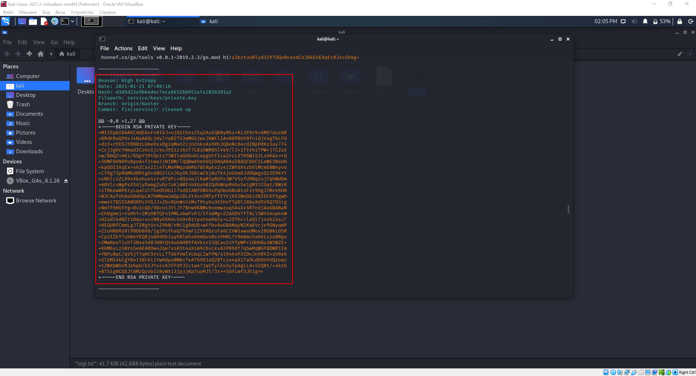
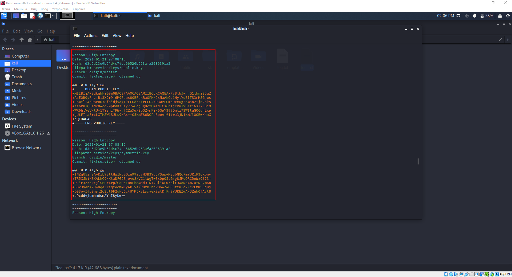
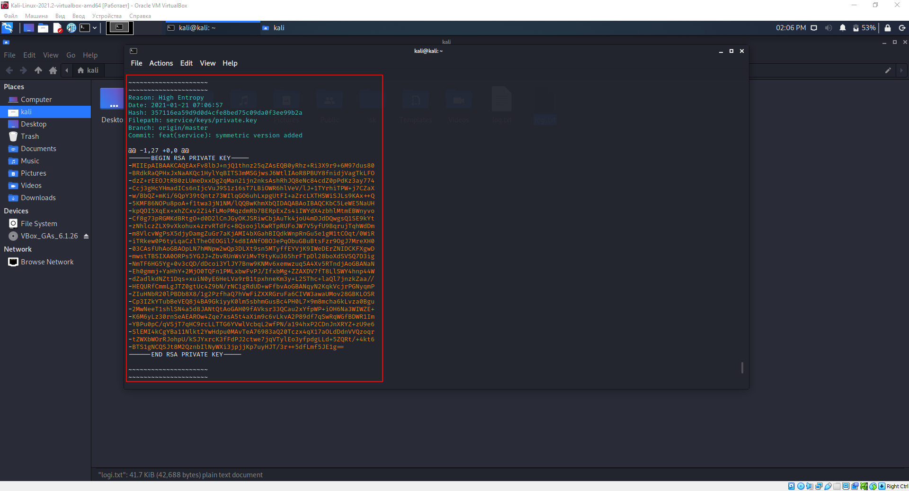
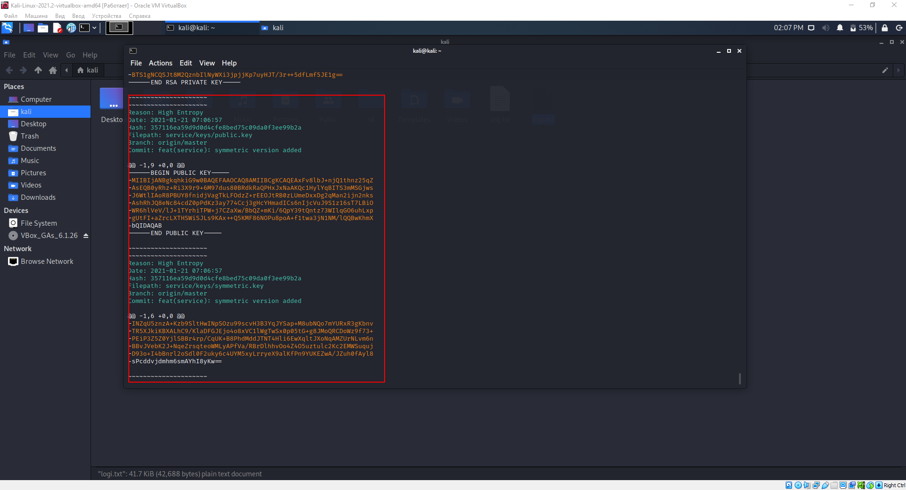
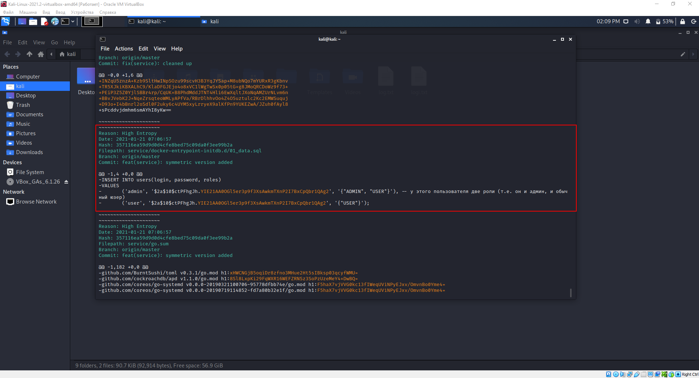
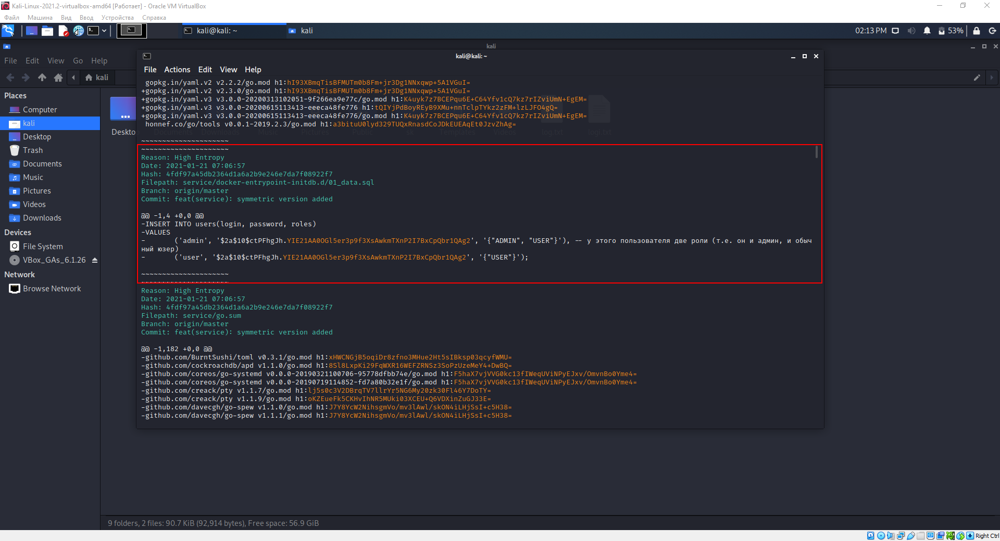

# Задание truffleHog

## Найденные секреты:

#### *Не вычищены криптографические ключи*

#### *Не вычищены данные с SQL базы. В данном секрете есть данные пользователей: Логин, Пароль и Роли.*

# Задание BFG Repo-Cleaner

Разработчики конечно проделали хорошую работу, но вычистили только ключи шифрования, а вот данные пользователей из SQL базы решили оставить. 

